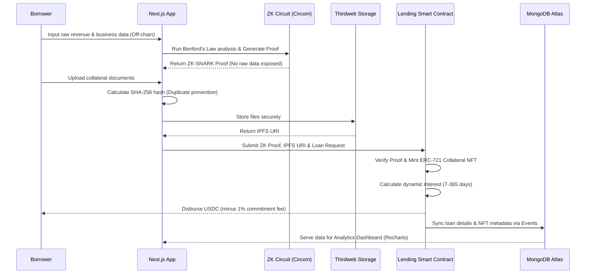

#  FESEE - SME Credit Platform with Collateral Tokenization

> **Nền tảng tín dụng cho doanh nghiệp vừa và nhỏ (SME) với token hóa tài sản thế chấp trên blockchain**

Dự án FESEE là một giải pháp tín dụng phi tập trung sử dụng Zero-Knowledge Proof để xác minh doanh thu và NFT để token hóa tài sản thế chấp, giúp SME tiếp cận vốn dễ dàng hơn.


---

##  Mục lục

- [Tính năng chính](#-tính-năng-chính)
- [Kiến trúc hệ thống](#-kiến-trúc-hệ-thống)
- [Công nghệ sử dụng](#-công-nghệ-sử-dụng)
- [Cài đặt & Cấu hình](#-cài-đặt--cấu-hình)
- [Hướng dẫn chạy](#-hướng-dẫn-chạy)
- [Smart Contracts](#-smart-contracts)
- [Đẩy lên GitHub](#-đẩy-lên-github)

---

##  Tính năng chính

### 1. **Zero-Knowledge Credit Verification**
- Xác minh doanh thu mà không tiết lộ dữ liệu nhạy cảm
- Sử dụng ZK-SNARK (Circom + SnarkJS)
- Phân tích Benford's Law để phát hiện gian lận

### 2. **Collateral NFT Tokenization**
- Token hóa tài sản thế chấp thành NFT (ERC-721)
- Lưu trữ hình ảnh tài sản trên IPFS (Thirdweb Storage)
- Tính toán file hash (SHA-256) để chống trùng lặp
- 7 loại tài sản: Máy móc, Hàng tồn kho, Bất động sản, Phương tiện, Hóa đơn, Khoản phải thu, Khác

### 3. **Smart Lending System**
- Vay USDC dựa trên credit limit
- Lãi suất động theo kỳ hạn (7-365 ngày)
- Commitment fee (1% credit limit)
- Phí trả nợ sớm (early repayment bonus)

### 4. **MongoDB Integration**
- Lưu trữ lịch sử vay vốn
- Quản lý collateral NFTs
- API endpoints cho query nhanh
- Dashboard analytics
## 🔄 Kiến trúc hệ thống

The platform operates through a secure, four-step pipeline that ensures data privacy, transparent collateralization, and efficient loan management.



### 📋 Detailed Execution Steps

**1. Zero-Knowledge Credit Verification**
* The borrower inputs their raw financial and revenue data locally via the frontend.
* The system applies **Benford's Law** to detect statistical anomalies or potential fraud in the revenue numbers.
* A cryptographic proof is generated using **ZK-SNARK (Circom + SnarkJS)**. This proof guarantees that the borrower's revenue meets the required credit limit without revealing the actual numbers to the blockchain or the lender.

**2. Collateral NFT Tokenization**
* The borrower submits details of their physical or financial collateral (e.g., Real Estate, Machinery, Invoices).
* The system calculates a **SHA-256 file hash** to ensure the collateral has not been submitted previously.
* Metadata and images are uploaded to decentralized storage via **Thirdweb IPFS**.
* The smart contract mints a unique **ERC-721 NFT** representing the collateral, locking it within the protocol.

**3. Smart Lending Execution**
* Once the ZK proof is verified on-chain and the NFT is minted, the borrower requests a loan in **USDC**.
* The smart contract dynamically calculates the interest rate based on the requested loan term (ranging from 7 to 365 days).
* A **1% commitment fee** based on the credit limit is deducted, and the remaining USDC is transferred to the borrower's wallet.

**4. Tracking & Repayment (Hybrid Data Model)**
* Smart contract events are indexed and stored in **MongoDB Atlas** for high-speed querying.
* The Next.js frontend fetches this data to populate an interactive analytics dashboard (built with Recharts), allowing users to monitor loan statuses, collateral health, and historical data.
* If the borrower repays the loan early, the smart contract automatically applies an **early repayment bonus** and unlocks the collateral NFT.

---

##  Công nghệ sử dụng

### Blockchain & Smart Contracts
- **Solidity 0.8.20** - Smart contract language
- **Hardhat** - Development environment
- **Ethers.js v6** - Blockchain interaction
- **Sepolia Testnet** - Deployment network

### Frontend
- **Next.js 14** - React framework (App Router)
- **React 18** - UI library
- **TailwindCSS** - Styling
- **Recharts** - Data visualization

### Database & Storage
- **MongoDB Atlas** - NoSQL database
- **Mongoose** - ODM for MongoDB
- **Thirdweb Storage** - IPFS gateway

### Zero-Knowledge Proofs
- **Circom** - ZK circuit compiler
- **SnarkJS** - ZK proof generation/verification
- **Groth16** - Proving system

---

##  Cài đặt & Cấu hình

### 1. Clone Repository

```bash
git clone https://github.com/angianguyen/FESE.git
cd fesee-main
```

### 2. Cài đặt Dependencies

#### Smart Contracts
```bash
cd contracts
npm install
```

#### Frontend
```bash
cd frontend
npm install
```

### 3. Cấu hình Environment Variables

#### Frontend - Tạo file `frontend/.env.local`:

```env
# MongoDB Connection
MONGODB_URI=mongodb+srv://<username>:<password>@cluster.mongodb.net/fesee?retryWrites=true&w=majority

# Thirdweb IPFS Client ID (Get from: https://thirdweb.com/dashboard/settings/api-keys)
NEXT_PUBLIC_THIRDWEB_CLIENT_ID=your_thirdweb_client_id

# Contract Addresses — lấy từ contracts/deployed-addresses-<network>.json
# sau khi chạy scripts/deploy.js
NEXT_PUBLIC_STREAM_CREDIT_ADDRESS=
NEXT_PUBLIC_COLLATERAL_NFT_ADDRESS=
NEXT_PUBLIC_MOCK_USDC_ADDRESS=
NEXT_PUBLIC_VERIFIER_ADDRESS=

# API Base URL
NEXT_PUBLIC_API_URL=http://localhost:3000
```

#### Contracts - Tạo file `contracts/.env`:

```env
# Sepolia RPC URL (Get from Alchemy/Infura)
SEPOLIA_RPC_URL=https://eth-sepolia.g.alchemy.com/v2/your_api_key

# Private Key (NEVER commit this!)
PRIVATE_KEY=your_wallet_private_key_without_0x_prefix

# Etherscan API Key (for verification)
ETHERSCAN_API_KEY=your_etherscan_api_key
```

---

##  Hướng dẫn chạy

### A. Deploy Smart Contracts (Sepolia Testnet)

```bash
cd contracts
npx hardhat compile
npx hardhat run scripts/deploy.js --network sepolia
```

### B. Setup MongoDB

1. Tạo tài khoản MongoDB Atlas: https://www.mongodb.com/cloud/atlas
2. Tạo cluster mới (Free tier)
3. Tạo database user
4. Whitelist IP: `0.0.0.0/0` (cho development)
5. Copy connection string vào `frontend/.env.local`

### C. Chạy Frontend

```bash
cd frontend
npm run dev
```

Mở browser tại: `http://localhost:3000`

### D. Chạy Mock API (Optional)

```bash
cd mock-api
npm start
```

---

##  Smart Contracts

### Deployed Addresses

> ⚠️ Địa chỉ Sepolia của bản demo cũ đã được gỡ khỏi repo. Deployment đó chạy
> `MockVerifier` (verifier luôn trả về `true`) và dùng ABI cũ của
> `verifyAndUpdateCredit`, nên **không tương thích** với contract hiện tại.
> Cần deploy lại.

`scripts/deploy.js` ghi địa chỉ ra `contracts/deployed-addresses-<network>.json`
sau mỗi lần chạy:

```bash
cd contracts
npx hardhat run scripts/deploy.js                        # hardhat in-process
npx hardhat run scripts/deploy.js --network localhost    # local node
npx hardhat run scripts/deploy.js --network sepolia      # Groth16Verifier thật
```

Trên mạng local script deploy `MockVerifier` để chạy thử không cần proof thật.
Trên mọi mạng public nó luôn deploy `Groth16Verifier` sinh từ circuit.

| Contract | Purpose |
|----------|---------|
| **StreamCredit** | Lending protocol |
| **CollateralNFT** | NFT collateral |
| **MockUSDC** | Test stablecoin |
| **Groth16Verifier** | ZK proof verifier (mạng public) |
| **MockVerifier** | Verifier giả, chỉ dùng local |

---

##  Đẩy lên GitHub

### 1. Tạo file `.gitignore`

```bash
# Dependencies
node_modules/

# Environment Variables
.env
.env.local
contracts/.env

# Next.js
.next/
out/
build/

# Production
*.log

# Hardhat
cache/
artifacts/

# ZK Circuit
*.zkey
*.r1cs
*.wasm

# IDE
.vscode/
.idea/

# OS
.DS_Store
```

### 2. Git Commands

```bash
# Initialize Git
git init

# Add all files
git add .

# Commit
git commit -m "feat: Complete FESEE platform with NFT collateral"

# Add remote
git remote add origin https://github.com/angianguyen/FESE.git

# Push
git branch -M main
git push -u origin main
```

---

##  Support

- **GitHub**: https://github.com/angianguyen/FESE
- **Issues**: https://github.com/angianguyen/FESE/issues

---

**Built with  by FESEE Team**
